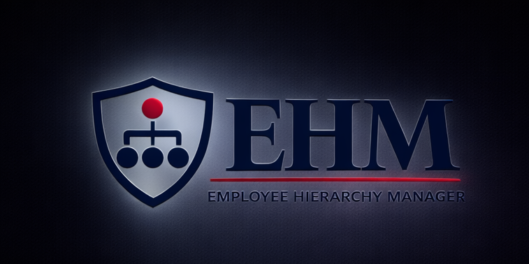

<div align="center">
  
  
  # EPI-USE Employee Management System
  **Official Personnel Registry & Hierarchy Visualization**
  
  [](https://reactjs.org/)
  [](https://nodejs.org/)
  [](https://www.postgresql.org/)
  [](https://sequelize.org/)

  ---
  
  A modern, full-stack application designed to manage complex organizational structures. 
  Built as a technical assessment for **EPI-USE Africa**.
</div>

## 🚀 Overview
This platform provides a centralized hub for managing employee data, visualizing reporting lines, and maintaining organizational integrity. It features a high-performance registry and an interactive D3-powered org chart.

### 💎 Key Features
- **📊 Dynamic Org Chart:** Interactive, zoomable hierarchy visualization with drag-and-drop reassignment.
- **📁 Personnel Registry:** Advanced search, filtering, and sorting for large-scale employee lists.
- **🔐 Permission Levels:** Role-based access control (Admin, HR, Manager, Employee).
- **🖼️ Gravatar Integration:** Automated profile picture synchronization via email hashing.
- **📥 Data Portability:** Export the entire registry to high-quality CSV format.
- **🛡️ Security:** JWT-based authentication and Bcrypt password encryption.

---

## 🛠️ Technology Stack
- **Frontend:** React.js, Material UI (MUI), D3-hierarchy, React-DND.
- **Backend:** Node.js, Express.js (v5), JSON Web Tokens.
- **Database:** PostgreSQL with Sequelize ORM.
- **Deployment:** Vercel (Frontend & Serverless API), Neon (Serverless Postgres).

---

## ⚡ Quick Start

### 1. Prerequisites
- Node.js (v20+)
- A PostgreSQL Database (Local or Cloud)

### 2. Installation
```bash
# Clone the repository
git clone https://github.com/Sparta379/employee-hierarchy-app.git

# Install dependencies for both client and server
npm install
```

### 3. Environment Setup
Create a `.env` file in the `server/` directory with the following:
```env
DATABASE_URL=your_postgres_url
JWT_SECRET=your_secret_key
PORT=5000
```

### 4. Seed & Start
```bash
# Seed the initial technical company data
npm run seed

# Run the development environment (concurrently starts client & server)
npm run dev
```

---

## 📂 Documentation
For more detailed information, please refer to the following documents in the `docs/` folder:
- [Technical Architecture](./docs/EpiUse%20App%20Technical%20Document.md)
- [User Guide](./docs/EpiUse%20App%20User%20Guide.md)

---

## 👤 Author
**Dandre Vermaak**  
EPI-USE Technical Assessment - February 2026
