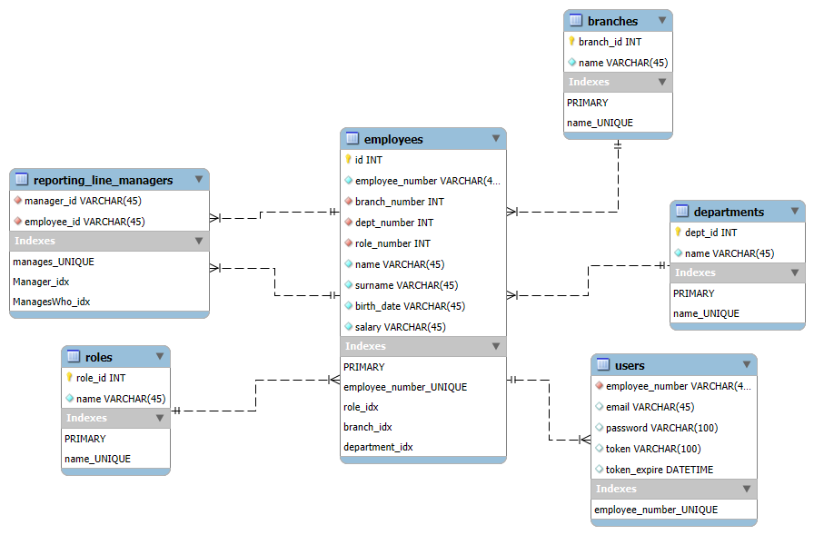
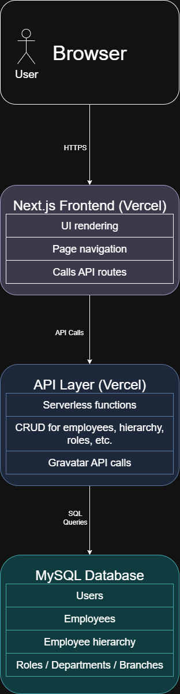

# **EPI-USE-Employee Hierarchy Management – Technical Document**
  

# **Architecture**:
## **1. Overview**

The EPI-USE-Employee Hierarchy Management Web App is a **Next.js** application with an **API layer hosted on Vercel** and a database hosted on an **Oracle VM** using a **MySQL server**.
  It provides tools for managing the organization’s employee hierarchy, roles, departments, and branches, along with user authentication and profile management via Gravatar.

---

## **2. System Components**

### **Frontend**

* **Framework**: Next.js (App Router)
* **Hosting**: Vercel
* **Main Features**:

  * **Authentication**: Login and register pages.
  * **Hierarchy View**:

    * Default home page view.
    * Interactive tree view with ability to search/edit hierarchy and view employee details/Gravatars.
  * **List View**:

    * Search and filter employees.
    * Edit employee details.
    * Remove employees from database.
  * **Management Pages**:

    * Manage employees (add).
    * Manage roles, departments, and branches (add/edit/delete).
  * **Profile Page**:

    * Displays user Gravatar.
    * Allows editing Gravatar via Gravatar API integration.

---

### **API Layer**

* **Platform**: Serverless API routes (Vercel/Next.js Functions)
* **Responsibilities**:

  * Handle CRUD operations for:

    * Employees
    * Hierarchy relationships
    * Roles
    * Departments
    * Branches
  * Authentication (login/register and session management)
  * Profile and Gravatar API integration
* **Security**:

  * Input validation before DB operations.

---

### **Database**

* **Platform**: Postgres database hosted on Neon (managed cloud Postgres)
* **Tables** (key examples):

  * `users`
  * `employees`
  * `reporting_line_managers`
  * `roles`
  * `departments`
  * `branches`
* **Purpose**:

  * Store persistent user, employee, and organizational data.
  * Maintain hierarchical relationships via `reporting_line_managers`.
* **EER-Diagram**

  

---

## **3. Data Flow**

1. **User Request** → Browser sends request to Next.js frontend.
2. **API Call** → Frontend fetches data from Vercel API routes.
3. **Database Query** → API route queries the Neon Postgres database.
4. **Response** → API returns JSON to frontend.
5. **UI Update** → Next.js renders updated UI (SSR/CSR).

---

## **4. Navigation Structure**

* **Login/Register** → `/login`, `/register`
* **Home** → `/`
* **Management** → `/management`

  * `/employees`
  * `/roles`
  * `/departments`
  * `/branches`
* **Profile** → `/profile`

## **5. Basic Architecture Diagram**

---
   
---

# **Design Patterns**:

## **Observer Pattern**

* The Observer Pattern is used to automatically update the UI when state changes occur.
* This is implemented through React hooks (`useState`, `useEffect`, and `useMemo`) that observe state changes and trigger UI updates accordingly.
* Example: Dark/light mode detection and responsive styling.

## **Command Pattern**

* The Command Pattern is applied by triggering functions in response to user actions.
* This happens through event listeners such as `onMouseDown` and other interaction handlers.
* Example: Drag-and-drop functionality in the hierarchy view.

## **Strategy Pattern**

* The Strategy Pattern is applied by dynamically choosing which component to render based on user interaction.
* This is done by switching the `view` state between `'hierarchy'` and `'list'`.
* Example: Rendering either the `EmployeeTree` or `EmployeeList` component on the home page depending on the selected view.

---
   
---

# **Technology choices**:
## **Frontend Framework**: Next.js (App Router)
* I chose Next.js for the Static Site Generation which works well in vercel.
* I chose to use the App Router for a clean project structure and the automatic routing that comes with it.
* API route integration allows for seamless communication between frontend and backend.
* It is React-based, so I can use the react ecosystem

## **Backend/API Hosting**: Vercel
* I chose Vercel for its seamless integration with GitHub, simplifying continuous deployment workflows.
* Its serverless functions automatically scale with demand, ensuring efficient resource usage.
* The stateless, event-driven nature of API routes allows for easy maintenance and cost-effective hosting.
* Vercel’s free tier provides preview and production domains, though it uses low-end server hardware, which can affect responsiveness. This is common among free-tier hosting options.
* While AWS offers more powerful infrastructure, its steep learning curve and my lack of prior experience made it impractical given the project’s time constraints.

## **Database**: Neon Postgres (managed Postgres)
* The database is a **Postgres instance hosted on Neon**, a managed cloud Postgres provider.
* This approach was chosen for its generous free tier, automatic scaling, and tight integration with modern frameworks.  Neon removes the need to maintain our own VM while still providing full-featured Postgres.
* While I considered running my own MySQL instance on a VM, using Neon allowed me to focus on the application logic instead of server administration, which was important given the assessment’s time constraints.

## **Profile Integration**: Gravatar API
* The Gravatar API was chosen to allow users to easily manage and update their profile pictures directly through their existing Gravatar accounts.
* This approach provides a seamless user experience by leveraging a widely adopted, familiar service without requiring additional image upload features in the app.

---
   
---

# **Justification**

## Design Decisions:

* **User login and registration:** I decided to make it so only existing employees can register since the app is made for the company, not externals.  And this way it ensures that employees can set their own passwords and emails, not requiring admin to provide these to the employees before logging in.
* **Hierarchy structure choice:** I opted for a tree structure rather than a graph structure because each employee should report to only one manager.  Allowing multiple reporting lines could lead to communication issues and complexity in management.

* **Editing restrictions:** Editing employee information is limited to the list view, rather than allowing changes directly within the tree view.  This decision helps avoid clutter and complexity that would arise from embedding editing features within the hierarchical tree interface.

* **Hierarchy creation constraints:** Creating a reporting hierarchy can only be done from the list view and not from the tree view.  Since a hierarchy requires at least two employees, and drag-and-drop operations on multiple employees simultaneously are not supported, the list view is the more practical place to manage this.

* **Search functionality:** The hierarchy search operates in two phases due to inconsistencies with asynchronous calls and the absence of a reliable workaround.  This phased approach improves search reliability and user experience.

* **Time and skill considerations:** Many of the design decisions were influenced by time constraints and my current skill set.  I chose to avoid exploring too many new technologies to keep the project manageable and ensure timely completion.

---
